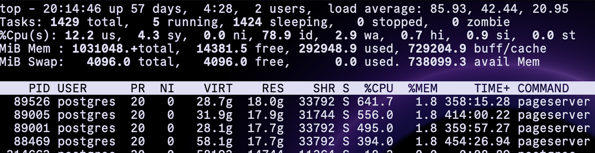

  
    

This document describes experiences running a Neon setup with installations in two Datacenters that are about 7-10ms latency apart.

  

If we want to make sure that databases have complete copies of all the data in multiple locations to prevent against data-loss on disasters or datacenter outages then we need a replication solution. 


There are different ways in which we could design such an environment when using Neon.

Principally:


1. A shared Neon “cluster” between multiple DC’s, where a single control-plane manages distributed Pageservers and safekeepers.
    
2. A Neon “cluster” per DC where each compute node just sends the WAL to a safekeeper in every DC but they are otherwise completely separate.
    

  
The main advantage of option 1 is that there is a single point of control and that primary and secondary pageserver roles can be made to move between Datacenters depending on workload. Its main disadvantage is that accessing a primary pageserver from a different datacenter incurs read-latency and adds an additional network-dependency.


The main advantage of option 2 is that replicas in DC2 can read local data and are not dependent on a cross-DC network link. The main disadvantage is that there are multiple Neon systems to manage and that layer-data is not transferable between the sites (only changes are replicated but layer-storage is not deterministic).

  

Option 1 looks like this:


  

Option 2 looks like this:


  
  

We have tested only option 2. Option 1 would have required us to find a way to make the storagecontroller, broker and S3 dual-DC HA (with split-brain protection), which would likely not be trivial. We also do not believe that running a replica on storage that is 10ms away would be a good idea but still wanted to stick to our common setup of “replica per Datacenter”. To make a replica in DC2 “fast” we feel that a local primary pageserver is required.  
During benchmarking we indeed found that running a replica in DC2 and reading from DC1 pageservers dropped read-throughput to about 30%!


Our findings

  

We have found that sharing safekeepers between sites in option 2 can have drawbacks for performance, even when we allocate safekeepers to not need dc2 for quorum. The reason for this is that pageservers need to ingest data at the speed it comes in and will inform compute when they can’t keep up. Compute will respond to that backpressure and start slowing down. This applies even when running only a minority of safekeepers in a slow DC (“async”). This behaviour is affected by the GUC settings `max_replication_write_lag` and `max_replication_flush_lag`.

Setting the above to very large values will allow a large backlog and not slow down the primary but has the consequence of keeping large amounts of WAL on the safekeeper of the slow site and possibly increasing compaction backlog on that site as well.

Note that this is in fact a feature, rather than a bug. Neon provides the opportunity to “control” lag between all sites this way, which native PostgreSQL cannot do. With Neon we would be able to prevent sites running out of sync by too much.

  
Compaction in general is a very resource-intensive and relatively time-consuming process, which must be accounted for. 

Observation is that compaction on our bare metal hardware (capable of writing at over 4 GB/sec and having 64 CPU cores) does not really do more than 10MB/sec per shard. This could present a bottleneck for workloads where writes per shard are consistently high and perhaps somewhat random. It should be noted here that the Neon-layers are zstd-compressed so the raw data written is several times more (pgbench-data seemed to compress at almost 10x and therefore 10MB/sec equates to much higher amounts of raw data written per shard).

  
A way to eliminate that cross-site performance dependency could for instance be to NOT include remote safekeepers but let independent tenants run per site and use a PG-replication mechanism. Logical replication should work out of the box but if we import the same tenant’s basebackup/S3-shards on the remote site then streaming replication should be possible as well although we did not test this.

  
We have found that Neon’s layer-compression is very effective. A 9.5TB pgbench database can be stored in about 950GB on S3. A compression-factor of 10.

  
On a bare metal setup we were able to reach high performance numbers when using pgbench. A backend, consisting of 4 pageservers hosted on a single machine with 8 RAID10 NVMe’s was able to max out (100% user CPU time) a compute-instance running on a 64-core 1TB RAM physical server under high-write conditions. Loading of a large pgbench-database was CPU-limited on the compute server.

The pageservers were growing the database at 300MB/second. The actual I/O on the combined 4 pageservers required for this was an average of 600MB/sec write and 2.2 GB/sec read. This was about double the speed of what we achieved on an older non-replicated (!) PostgreSQL17 server of comparable specifications.

  
As for OLTP benchmarking. Pgbench showed very good results. With 2 safekeepers in the DC1 datacenter and 1 in DC2 we achieved 68000 TPS on a 1000-scale database. 

Comparing against a standard PostgreSQL v17 instance on the same machine that even got the benefit of not having replication, Neon was much faster. The native setup only reached 43000 TPS !

  
Native PostgreSQL v17 on local storage:

  
```
$ pgbench -c 400 -j 128 -T 60 -p 5433 pgbench

pgbench (17.2)
starting vacuum...end.
transaction type: <builtin: TPC-B (sort of)>
scaling factor: 1000
query mode: simple
number of clients: 400
number of threads: 128
maximum number of tries: 1
duration: 60 s
number of transactions actually processed: 2567919
number of failed transactions: 0 (0.000%)
latency average = 9.340 ms
initial connection time = 102.050 ms
tps = 42825.744421 (without initial connection time)
```


  
Neon with safekeeper-quorum in DC1:

```
$ pgbench -c 400 -j 128 -T 60 -p 55432 -U cloud_admin -h localhost pgbench
starting vacuum...end.
transaction type: <builtin: TPC-B (sort of)>
scaling factor: 1000
query mode: simple
number of clients: 400
number of threads: 128
duration: 60 s
number of transactions actually processed: 4088803
latency average = 5.872 ms
tps = 68124.794565 (including connections establishing)
tps = 68154.477619 (excluding connections establishing)
```  


  

If we force quorum to stretch both DC’s (one safekeeper in DC1 and one in DC2) then throughput drops to less than half due to the cross-DC latency.

Neon with safekeeper-quorum over two sites (DC1 and DC2):

  
```
$ pgbench -c 400 -j 128 -T 60 -p 55432 -U cloud_admin -h localhost pgbench
starting vacuum...end.
transaction type: <builtin: TPC-B (sort of)>
scaling factor: 1000
query mode: simple
number of clients: 400
number of threads: 128
duration: 60 s
number of transactions actually processed: 1806039
latency average = 13.296 ms
tps = 30084.475777 (including connections establishing)
tps = 30097.241111 (excluding connections establishing)
```


  
We have also looked at large selects. Large range-scans are not what Neon is optimized for because it has to reconstruct individual pages and asking large numbers of them in quick succession is relatively “expensive”.

What we found was interesting, but in line with native behaviour of PostgreSQL 17.

Disk Index-reads are much slower than table-reads, likely because index-reads are not sequential reads and do not use readahead.

On Neon this was particularly easy to see thanks to it accessing storage over the network and thereby not using O/S cache.

When we did a large select over an index, we were only reading around 500-600 MBits/sec into compute. When we were doing the same over a table, we were seeing over 10 GBits/sec; more than 16 times difference! The likely cause of this is that PostgreSQL (and by extension, Neon) can do larger read-requests for tables (128KB per operation instead of 8KB) so one IOP for a table can read 16 times as much as one IOP for an index and in addition, large reads cover multiple shards whereas individual single-page requests do not.

A native PostgreSQL 17 instance on bare metal showed similar behaviour and in both cases it was faster to do a full table scan than to read the index (note that the index was about 20% of the size of the table but was read at less than 10% speed). 


Index-rebuilds on Neon were getting acceptable performance overall. It took 90 minutes to recreate a 209GB index on a 1.2TB table.

  
NOTE: because for building an index, Postgres uses temp-space on compute, the neon compute-instance requires local diskspace sufficiently large to cover the size of the index!

  
We eventually ended up with the following optimized settings for pageservers and used 8 of them (8-way tenant sharding). Neon is very actively improving I/O and these settings may be subject to change over time:

```
no_sync = false

disk_usage_based_eviction = {  max_usage_pct=80, min_avail_bytes=10000000000, period='10m' }

page_cache_size = 2000000

validate_wal_contiguity = true

virtual_file_io_mode = "direct-rw"

page_service_pipelining = { mode="pipelined", execution="concurrent-futures", max_batch_size=32, batching="uniform-lsn"}

get_vectored_concurrent_io = { mode="sidecar-task" }
```


# S3 performance

S3 did not ever appear to be a bottleneck during testing once we lifted the initial restrictions on request-rate and maximum number of files. While doing layer-file copies by hand (for backup/restore/import tests) we got some 900 MB/sec out of the relatively small test-environment that we were provided so we know that that was about the peak-rate that we could achieve over these connections.

Neon’s I/O is mostly concentrated on the local storage of the pageservers and S3 only handles:

- One unique copy of WAL from the safekeeper group (pglz compressed in our case)
    
- The finalized, compressed images and deltas from pageservers (zstd compressed)
    
- Incidental download of old (evicted) layer files
    

Even during our highest load-testing (filling pgbench databases) we would not reach 900 MB/sec to/from S3 apart from very short peaks. Depending on how many concurrent streams the S3 backend is able to handle we can at least conclude that for a single Neon cluster, S3 was not in any way a bottleneck. 

# Sharding

  
We found that IOPS per pageserver are limited and that capable hardware > 1GB/sec disk I/O will not be exhausted by a single pageserver. We could run 4 shards on a single machine before I/O-wait started to become a visible factor

Sharding a tenant increases throughput but lack of machinery meant that we were not reliably able to determine if it would make a difference going to 16 shards for example.

The maximum shard-size we reached was around 3TB (a 24TB database across 8 shards).

Pageserver I/O workloads combined to around 5GB/sec, regularly peaking over 6GB/sec.

  


  
  


  
  

Pageservers are heavily multithreaded:



  
  
A very large pgbench (400 clients, using 128 threads) can still make the system I/O-limited if insufficient shared_buffers and Local File Cache are configured. The below output from “top” shows that half the CPU-time is going to system calls (network I/O):


  

The above shows that (unsurprisingly) for very large amounts of “hot data” it will be a requirement to appropriately cache it at the compute layer because Neon’s networked disk I/O’s are more “expensive” than they are on a PostgreSQL-server with local storage..

# Performance conclusions

  

Though we did not get around to running real-life workloads, the behaviour during pgbench and manual SQL statements suggested the following:


- Given powerful enough hardware, even a single machine with local NVMe-disks and multiple pageservers running on it can sustain 300MB/sec database-growth without running into a backlog of compaction. We should expect a dedicated Neon-system using multiple pageservers and NVMe-drives to easily handle production workload of several clusters.
    
- Safekeepers are very powerful. A single safekeeper can sustain over 30GBits/sec bandwidth towards pageservers. It is to be expected that a single safekeeper can handle the workload of many production databases
    
- Index-pages appear to not be cached by the LFC ? When large indexes are used, shared_buffers needs to be sufficiently large to cache enough of them because network-reads of index-pages are high overhead.  
    
- The sync quorum write nature of safekeepers means that remote Datacenters will have a significant impact on write performance (as synchronous replication in Postgres does). A “workaround” is possible, as explained in the next paragraph.
    
- Warmup-costs of Neon are high. Reading data into local cache over the network is considerably slower than doing that from fast local disks. Pre-warming will be a requirement and relatively large LFC and shared_buffers values may be necessary
    
- Neon did very well on synthetic OLTP benchmarks. In practice, workloads may have an OLAP-like component (long running queries hitting large amounts of data). Those workloads may or may not transfer badly (probably badly).
    
- We did not get around to testing out longer-term behaviour of production-like data, especially with regards to recurring VACUUM activity. It is expected that VACUUM-ing large amounts of data in Neon will be problematic but this would need to be tested.
    
- Instance startup-time with Neon is indeed very short. A database-instance can be running within seconds after a forced crash. With regular Postgres this can easily be minutes (crash recovery is always required).
    
- Generally speaking, it looks that a Neon system can outpace a dedicated local Postgres-instance but with maximum load, two instances will still bottleneck on a single pageserver-node with the current code. Neon is probably very well suited to running a decent number of relatively benign workloads on a few pageservers but in the end, a fully optimized dedicated native PostgreSQL server with local storage will provide the best predictability in performance for a single database, especially for read-heavy workloads on very large databases. This is a trade-off (pets versus cattle). Neon’s architecture may not always be the optimal choice because it penalizes non-OLTP activity quite severely in this testing.
    
- The pgbench testing suggests that performance can be very good even with very large database-sizes. We must however note the caveat that complex workloads on such data (and VACUUMs…) may behave differently. The type of workload may on large databases be more important than the database-size per-se. Due to its networked design, Neon will likely magnify inefficiencies in schema-design and queries. 
    
- Cache is king but the larger the cache, the higher the overhead for Postgres to maintain it and handle page eviction. Optimal settings would need to be determined depending on each workload.
    
- For mass multitenancy we would probably want to use many pageservers in a single Neon-cluster so that we may spread the overall load over as many endpoints as possible. We have not gotten around to testing how many pageservers are a realistic maximum for a single storage-controller/broker and S3 endpoint. This would be interesting to test because it determines the upper bounds of how many tenants we think are attainable on a single cluster.
    
- Neon was designed to handle very high tenant-counts and timelines per tenant (i.e.: very high shard counts). It does not look likely that we’d run into limitations on the number of shards that a pageserver can handle.
    

# Asynchronous replication option

By design, writing to safekeepers in multiple Datacenters means that a commit does not complete before a quorum of safekeepers has acknowledged receipt. This is comparable to Postgres’ synchronous commit mode. Many databases may not be required to have such a high level of data-loss protection and would rather write “faster” by foregoing the wait for data to arrive on a secondary site. For this case we might use a configuration such as the following:

- Each DC also has a safekeeper for each remote DC (for example: DC1 has a safekeeper that is part of the DC2-cluster and writes to DC2 pageservers and S3 and it has one for DC3 as well)
    
- “Async” tenants use those safekeepers instead of the ones that are located in each Datacenter
    

  
In the above configuration, the WAL-writes are always local to the tenant’s DC (low network latency) but replication towards remote pageservers and S3 becomes asynchronous. Asynchronicity is bound by the tenant’s GUC settings  max_replication_write_lag and max_replication_flush_lag.

  

What is the risk here ? Split-brain becomes a risk, like it is with regular Postgres. It is possible that writes were done to WAL in the tenant’s primary DC that never made it to a remote DC. if we would start a read-write compute in that remote DC then the changes that were made in the failing site were already persisted locally and the tenant’s timeline in that DC needs to be “rolled back”/re-initialized to get back in line with our “promoted” site, which is starting to write from an earlier point in the timeline.


Unless there is a hard need for it, we would not recommend to use this configuration. Split-brain protection and guaranteed multi-site data-consistency are major advantages of Neon and foregoing them defeats much of the purpose of using it to begin with.

  

## Compute performance

We ran compute in containers. Both “podman” as well as Docker were used. No Kubernetes.

We observed that the instances were able to effectively use the available CPU-power and memory.  Neon compute requires less local I/O than a regular Postgres instance but it can still be a factor when co-hosting computes on a single machine. Local I/O that is still relevant:

- Temp space for handling data that does not fit in a session’s working memory (large sorts, merge joins, index creation, etc.)
    
- Local WAL (neon instances do still write to local WAL; safekeepers are effectively treated as replicas)
    
  
    
  

# Detailed PGBench results. Various performance tests

  

two safekeepers in DC1:
  
```
$ pgbench -i -s 1000 -p 55432 -U cloud_admin -h localhost pgbench

dropping old tables...

creating tables...

generating data (client-side)...

100000000 of 100000000 tuples (100%) done (elapsed 43.43 s, remaining 0.00 s)

vacuuming...

creating primary keys...

done in 133.48 s (drop tables 0.03 s, create tables 0.00 s, client-side generate 43.92 s, vacuum 45.45 s, primary keys 44.09 s)
```


  
```
$ pgbench -c 400 -j 128 -T 60 -p 55432 -U cloud_admin -h localhost pgbench

starting vacuum...end.

transaction type: <builtin: TPC-B (sort of)>

scaling factor: 1000

query mode: simple

number of clients: 400

number of threads: 128

duration: 60 s

number of transactions actually processed: 3937287

latency average = 6.097 ms

tps = 65603.747222 (including connections establishing)

tps = 65632.568471 (excluding connections establishing)
```


  

one safekeeper in DC1:

```
$ pgbench -i -s 1000 -p 55432 -U cloud_admin -h localhost pgbench

dropping old tables...

creating tables...

generating data (client-side)...

100000000 of 100000000 tuples (100%) done (elapsed 43.07 s, remaining 0.00 s)

vacuuming...

creating primary keys...

done in 105.70 s (drop tables 0.04 s, create tables 0.01 s, client-side generate 48.61 s, vacuum 12.89 s, primary keys 44.15 s).
```  


 ```
$ pgbench -c 400 -j 128 -T 60 -p 55432 -U cloud_admin -h localhost pgbench

starting vacuum...end.

transaction type: <builtin: TPC-B (sort of)>

scaling factor: 1000

query mode: simple

number of clients: 400

number of threads: 128

duration: 60 s

number of transactions actually processed: 3998426

latency average = 6.006 ms

tps = 66602.771674 (including connections establishing)

tps = 66631.451468 (excluding connections establishing)
``` 


  

---

one safekeeper in DC1 and one safekeeper in DC2 (pointed to DC1):

```
$ pgbench -i -s 1000 -p 55432 -U cloud_admin -h localhost pgbench

dropping old tables...

creating tables...

generating data (client-side)...

100000000 of 100000000 tuples (100%) done (elapsed 43.38 s, remaining 0.00 s)

vacuuming...

creating primary keys...

done in 198.51 s (drop tables 97.42 s, create tables 0.04 s, client-side generate 43.90 s, vacuum 13.03 s, primary keys 44.12 s).
```


```
$ pgbench -c 400 -j 128 -T 60 -p 55432 -U cloud_admin -h localhost pgbench

starting vacuum...end.

transaction type: <builtin: TPC-B (sort of)>

scaling factor: 1000

query mode: simple

number of clients: 400

number of threads: 128

duration: 60 s

number of transactions actually processed: 1806039

latency average = 13.296 ms

tps = 30084.475777 (including connections establishing)

tps = 30097.241111 (excluding connections establishing)
```
  


---

two safekeepers in DC1 and one safekeeper in DC2 (pointed to DC1):

```
$ pgbench -i -s 1000 -p 55432 -U cloud_admin -h localhost pgbench

dropping old tables...

creating tables...

generating data (client-side)...

100000000 of 100000000 tuples (100%) done (elapsed 44.51 s, remaining 0.00 s)

vacuuming...

creating primary keys...

done in 103.20 s (drop tables 0.07 s, create tables 0.02 s, client-side generate 45.01 s, vacuum 13.53 s, primary keys 44.57 s).
```

  
```
$ pgbench -c 400 -j 128 -T 60 -p 55432 -U cloud_admin -h localhost pgbench

starting vacuum...end.

transaction type: <builtin: TPC-B (sort of)>

scaling factor: 1000

query mode: simple

number of clients: 400

number of threads: 128

duration: 60 s

number of transactions actually processed: 4088803

latency average = 5.872 ms

tps = 68124.794565 (including connections establishing)

tps = 68154.477619 (excluding connections establishing)

```


  

---

one safekeeper in DC2 talking to pageservers in DC1

```
$ pgbench -i -s 1000 -p 55432 -U cloud_admin -h localhost pgbench

dropping old tables...

creating tables...

generating data (client-side)...

100000000 of 100000000 tuples (100%) done (elapsed 43.05 s, remaining 0.00 s)

vacuuming...

creating primary keys...

done in 100.80 s (drop tables 0.07 s, create tables 0.05 s, client-side generate 43.59 s, vacuum 12.87 s, primary keys 44.22 s)

```
  

```
$ pgbench -c 400 -j 128 -T 60 -p 55432 -U cloud_admin -h localhost pgbench

starting vacuum...end.

transaction type: <builtin: TPC-B (sort of)>

scaling factor: 1000

query mode: simple

number of clients: 400

number of threads: 128

duration: 60 s

number of transactions actually processed: 1824071

latency average = 13.164 ms

tps = 30384.849143 (including connections establishing)

tps = 30397.810691 (excluding connections establishing)
```


One safekeeper in DC1 and 4 pageservers in DC1 (4 way sharded). Three concurrent pgbench creations. 150,000 size databases:

```
$ pgbench -i -s 150000 -U cloud_admin -p 55432 -h localhost pgbench ; sleep infinity

dropping old tables...

NOTICE:  table "pgbench_accounts" does not exist, skipping

NOTICE:  table "pgbench_branches" does not exist, skipping

NOTICE:  table "pgbench_history" does not exist, skipping

NOTICE:  table "pgbench_tellers" does not exist, skipping

creating tables...

generating data (client-side)...

vacuuming...                                                                                        )

creating primary keys...

done in 53630.64 s (drop tables 0.00 s, create tables 0.00 s, client-side generate 10791.71 s, vacuum 9.81 s, primary keys 42829.11 s).

```

```
$ pgbench -i -s 150000 -U cloud_admin -p 55432 -h localhost pgbench2 ; sleep infinity

dropping old tables...

NOTICE:  table "pgbench_accounts" does not exist, skipping

NOTICE:  table "pgbench_branches" does not exist, skipping

NOTICE:  table "pgbench_history" does not exist, skipping

NOTICE:  table "pgbench_tellers" does not exist, skipping

creating tables...

generating data (client-side)...

vacuuming...                                                                                        )

creating primary keys...

done in 22543.52 s (drop tables 0.00 s, create tables 0.04 s, client-side generate 10676.61 s, vacuum 21.35 s, primary keys 11845.51 s).
```


```
$ pgbench -i -s 150000 -U cloud_admin -p 55432 -h localhost pgbench3 ; sleep infinity

dropping old tables...

NOTICE:  table "pgbench_accounts" does not exist, skipping

NOTICE:  table "pgbench_branches" does not exist, skipping

NOTICE:  table "pgbench_history" does not exist, skipping

NOTICE:  table "pgbench_tellers" does not exist, skipping

creating tables...

generating data (client-side)...

vacuuming...                                                                                        )

creating primary keys...

done in 54648.53 s (drop tables 0.00 s, create tables 0.18 s, client-side generate 10701.54 s, vacuum 20.96 s, primary keys 43925.84 s).
```
  


This last three-concurrent benchmark gives the following database sizes:

```
postgres=# \l+

List of databases

pgbench   | 2190 GB 

pgbench2  | 2190 GB 

pgbench3  | 2190 GB 

postgres=#
```


  

Each database has the following indexes created after the initial load:

  
```
pgbench=# \di+

List of relations

  

 public | pgbench_accounts_pkey | index | pgbench_accounts | 314 GB 

 public | pgbench_branches_pkey | index | pgbench_branches | 3312 kB

 public | pgbench_tellers_pkey  | index | pgbench_tellers  | 32 MB
```


  

The raw (without PK) database size loaded was 2190 - 314 GB per database = 1876 GB. The above results shows we were able to load 3 x 1876 GB = 5.6 TB in a little under 3 hours -> 524 MB/sec.

  
Neon’s layer compression is very effective. The total instance size of 3x2190GB = 6.5 TB fits in 633 GB on S3. A little more than 10X compression for this type of data!


A single pgbench run on one of the above three databases generates a consistent 6.4 GBits/second traffic from compute to pageserver (200 MB/sec per pageserver) and shows excellent results for such a large warehouse (non-partitioned!):


First run:

```
$ pgbench -c 400 -j 128 -T 60 -p 55432 -U cloud_admin -h localhost -S pgbench

starting vacuum...end.

transaction type: <builtin: select only>

scaling factor: 150000

query mode: simple

number of clients: 400

number of threads: 128

duration: 60 s

number of transactions actually processed: 2755997

latency average = 8.721 ms

tps = 45868.922594 (including connections establishing)

tps = 45888.782493 (excluding connections establishing)
```
  

  

Second run (after cache warming. LFC is 300GB and shared_buffers are 256 GB, WAL-level is logical):

```
$ pgbench -c 400 -j 128 -T 60 -p 55432 -U cloud_admin -h localhost -S pgbench

starting vacuum...end.

transaction type: <builtin: select only>

scaling factor: 150000

query mode: simple

number of clients: 400

number of threads: 128

duration: 60 s

number of transactions actually processed: 3091246

latency average = 7.777 ms

tps = 51436.439036 (including connections establishing)

tps = 51459.737314 (excluding connections establishing)

```
  


  
The benchmarks suffer when running two at the same time on two different databases. Bottlenecked by the pageservers:

```
$ pgbench -c 400 -j 128 -T 60 -p 55432 -U cloud_admin -h localhost -S pgbench

starting vacuum...end.

transaction type: <builtin: select only>

scaling factor: 150000

query mode: simple

number of clients: 400

number of threads: 128

duration: 60 s

number of transactions actually processed: 1307961

latency average = 18.378 ms

tps = 21765.437540 (including connections establishing)

tps = 21776.126882 (excluding connections establishing)
```


  

The 4 pageservers are likely the limiting factor here. They had very high I/O-wait, suggesting their local disks were overwhelmed. Bandwidth drops to 5.2 GBits/sec.

  

Point-selects are nicely fast:

  
```
pgbench=# select * from pgbench_accounts where aid=13745849;

   aid | bid | abalance |                                    filler

----------+-----+----------+--------------------------------------------------------------------------------------

 13745849 | 138 |    0 |

(1 row)

  

Time: 0.151 ms

pgbench=# select * from pgbench_accounts where aid=145849;

  aid   | bid | abalance |                                    filler

--------+-----+----------+--------------------------------------------------------------------------------------

 145849 |   2 |    0 |

(1 row)

  

Time: 2.227 ms

pgbench=# select * from pgbench_accounts where aid=145838748949;

 aid | bid | abalance | filler

-----+-----+----------+--------

(0 rows)

  

Time: 1.570 ms
```


  

Difference between a cached result and a fetched result:

```
pgbench=# select * from pgbench_accounts where aid=145838748949;

 aid | bid | abalance | filler

-----+-----+----------+--------

(0 rows)

  

Time: 1.570 ms

pgbench=# select * from pgbench_accounts where aid=145838748949;

 aid | bid | abalance | filler

-----+-----+----------+--------

(0 rows)

  

Time: 0.270 ms
```  


  

A partial table scan of a million rows:

```
pgbench=# select max(bid) from pgbench_accounts where aid between 345678 and 1345678;

 max

-----

  14

(1 row)

  

Time: 632.233 ms
```


  

Same cached:

```
pgbench=# explain (analyze,buffers,timing) select max(bid) from pgbench_accounts where aid between 345678 and 1345678;

                                                                                 QUERY PLAN

  

--------------------------------------------------------------------------------------------------------------------------------------------

--------------------------------------

 Finalize Aggregate  (cost=47735.15..47735.16 rows=1 width=4) (actual time=49.121..60.479 rows=1 loops=1)

   Buffers: shared hit=19133

   ->  Gather  (cost=47734.73..47735.14 rows=4 width=4) (actual time=49.068..60.473 rows=5 loops=1)

      Workers Planned: 4

      Workers Launched: 4

      Buffers: shared hit=19133

      ->  Partial Aggregate  (cost=46734.73..46734.74 rows=1 width=4) (actual time=46.168..46.169 rows=1 loops=5)

            Buffers: shared hit=19133

            ->  Parallel Index Scan using pgbench_accounts_pkey on pgbench_accounts  (cost=0.71..46013.35 rows=288553 width=4) (actual ti

me=0.090..38.397 rows=200000 loops=5)

                  Index Cond: ((aid >= 345678) AND (aid <= 1345678))

                  Buffers: shared hit=19133

 Planning:

   Buffers: shared hit=42

 Planning Time: 0.206 ms

 Execution Time: 60.504 ms

(15 rows)

  

Time: 60.990 ms

```  


  


80 Million rows select still fine (4 Gbits/sec transfer from pageserver, 66000 pages per second, 3.4 million rows per second):

```
pgbench=# explain (analyze,buffers,timing) select max(bid) from pgbench_accounts where aid between 2200345678 and 2280345678;

                                                                                    QUERY PLAN

  

--------------------------------------------------------------------------------------------------------------------------------------------

---------------------------------------------

 Finalize Aggregate  (cost=2914722.19..2914722.20 rows=1 width=4) (actual time=23230.523..23231.863 rows=1 loops=1)

   Buffers: shared hit=2 read=1530060

   I/O Timings: shared read=196734.555

   ->  Gather  (cost=2914721.36..2914722.17 rows=8 width=4) (actual time=23229.548..23231.855 rows=9 loops=1)

      Workers Planned: 8

      Workers Launched: 8

      Buffers: shared hit=2 read=1530060

      I/O Timings: shared read=196734.555

      ->  Partial Aggregate  (cost=2913721.36..2913721.37 rows=1 width=4) (actual time=23226.749..23226.750 rows=1 loops=9)

            Buffers: shared hit=2 read=1530060

            I/O Timings: shared read=196734.555

            ->  Parallel Index Scan using pgbench_accounts_pkey on pgbench_accounts  (cost=0.71..2890328.43 rows=9357175 width=4) (actual

 time=1.204..22852.596 rows=8888889 loops=9)

                  Index Cond: ((aid >= '2200345678'::bigint) AND (aid <= '2280345678'::bigint))

                  Buffers: shared hit=2 read=1530060

                  I/O Timings: shared read=196734.555

 Planning:

   Buffers: shared hit=6

 Planning Time: 0.113 ms

 Execution Time: 23231.886 ms

(19 rows)

  

Time: 23234.710 ms (00:23.235)
```


  

1 Billion rows is showing slowdown (56000 pages per second, 2.9 million rows per second):

```
pgbench=# explain (analyze,buffers,timing) select max(bid) from pgbench_accounts where aid between 5200345678 and 6200345678;

                                                                                       QUERY PLAN

  

--------------------------------------------------------------------------------------------------------------------------------------------

---------------------------------------------------

 Finalize Aggregate  (cost=40303239.05..40303239.06 rows=1 width=4) (actual time=341068.970..341070.660 rows=1 loops=1)

   Buffers: shared hit=2 read=19125689

   I/O Timings: shared read=2656320.661

   ->  Gather  (cost=40303238.02..40303239.03 rows=10 width=4) (actual time=341068.957..341070.655 rows=9 loops=1)

      Workers Planned: 10

      Workers Launched: 8

      Buffers: shared hit=2 read=19125689

      I/O Timings: shared read=2656320.661

      ->  Partial Aggregate  (cost=40302238.02..40302238.03 rows=1 width=4) (actual time=341065.419..341065.420 rows=1 loops=9)

            Buffers: shared hit=2 read=19125689

            I/O Timings: shared read=2656320.661

            ->  Parallel Index Scan using pgbench_accounts_pkey on pgbench_accounts  (cost=0.71..40041287.72 rows=104380118 width=4) (act

ual time=1.337..336379.619 rows=111111111 loops=9)

                  Index Cond: ((aid >= '5200345678'::bigint) AND (aid <= '6200345678'::bigint))

                  Buffers: shared hit=2 read=19125689

                  I/O Timings: shared read=2656320.661

 Planning Time: 0.093 ms

 Execution Time: 341070.683 ms

(17 rows)

  

Time: 341071.053 ms (05:41.071)
```


  
  

2 billion rows (49000 pages per second, 2.5 million rows per second):

```
pgbench=# explain (analyze,buffers,timing) select max(bid) from pgbench_accounts where aid between 7200345678 and 9200345678;

                                                                                       QUERY PLAN

  

--------------------------------------------------------------------------------------------------------------------------------------------

---------------------------------------------------

 Finalize Aggregate  (cost=78945337.97..78945337.98 rows=1 width=4) (actual time=781022.992..781024.820 rows=1 loops=1)

   Buffers: shared hit=2 read=38251371

   I/O Timings: shared read=5854426.035

   ->  Gather  (cost=78945336.84..78945337.95 rows=11 width=4) (actual time=781022.984..781024.816 rows=9 loops=1)

      Workers Planned: 11

      Workers Launched: 8

      Buffers: shared hit=2 read=38251371

      I/O Timings: shared read=5854426.035

      ->  Partial Aggregate  (cost=78944336.84..78944336.85 rows=1 width=4) (actual time=781019.283..781019.284 rows=1 loops=9)

            Buffers: shared hit=2 read=38251371

            I/O Timings: shared read=5854426.035

            ->  Parallel Index Scan using pgbench_accounts_pkey on pgbench_accounts  (cost=0.71..78478282.00 rows=186421936 width=4) (act

ual time=4.816..771667.506 rows=222222222 loops=9)

                  Index Cond: ((aid >= '7200345678'::bigint) AND (aid <= '9200345678'::bigint))

                  Buffers: shared hit=2 read=38251371

                  I/O Timings: shared read=5854426.035

 Planning Time: 0.093 ms

 Execution Time: 781024.843 ms

(17 rows)

  

Time: 781025.228 ms (13:01.025)
```


  

Pgbench on a 600,000 size DWH (60 billion rows in a single 7.5TB non-partitioned table…) looks good at 31000 transactions per second:

```
$ pgbench -c 400 -j 128 -T 60 -p 55432 -U cloud_admin -h localhost pgbench

starting vacuum...end.

transaction type: <builtin: TPC-B (sort of)>

scaling factor: 600000

query mode: simple

number of clients: 400

number of threads: 128

duration: 60 s

number of transactions actually processed: 1868528

latency average = 12.846 ms

tps = 31137.839750 (including connections establishing)

tps = 31154.119985 (excluding connections establishing)

```  


  

  

1000 size. Compute in DC1. Two safekeepers in DC1 one safekeeper in DC2. It is sharded 8 ways using 4 pageservers.

SECOND pgbench run (after cache warming) 

 ```
 $ pgbench -c 400 -j 128 -T 60 -p 55432 -U cloud_admin -h localhost pgbench

pgbench (17.4)

starting vacuum...end.

transaction type: <builtin: TPC-B (sort of)>

scaling factor: 1000

query mode: simple

number of clients: 400

number of threads: 128

maximum number of tries: 1

duration: 60 s

number of transactions actually processed: 3383651

number of failed transactions: 0 (0.000%)

latency average = 7.082 ms

initial connection time = 112.146 ms

tps = 56480.648617 (without initial connection time)

``` 


  
  

On a local dedicated instance without replication:

  
```
$ pgbench -c 400 -j 128 -T 60 -p 5433 pgbench

pgbench (17.2)

starting vacuum...end.

transaction type: <builtin: TPC-B (sort of)>

scaling factor: 1000

query mode: simple

number of clients: 400

number of threads: 128

maximum number of tries: 1

duration: 60 s

number of transactions actually processed: 2567919

number of failed transactions: 0 (0.000%)

latency average = 9.340 ms

initial connection time = 102.050 ms

tps = 42825.744421 (without initial connection time)
```


  

Neon was 32% FASTER than dedicated local instance on pgbench with high concurrency even when asking each pageserver to handle two shards.

  

To verify that instance-caching in Neon works well… 370K TPS on a read-only benchmark:

```
$ pgbench -c 400 -j 128 -T 60 -S -p 55432 -U cloud_admin -h localhost pgbench

pgbench (17.4)

starting vacuum...end.

transaction type: <builtin: select only>

scaling factor: 1000

query mode: simple

number of clients: 400

number of threads: 128

maximum number of tries: 1

duration: 60 s

number of transactions actually processed: 22201067

number of failed transactions: 0 (0.000%)

latency average = 1.080 ms

initial connection time = 110.544 ms

tps = 370513.041941 (without initial connection time)

  
```


Reading a 1.2TB table with 8-way sharded Neon over 4 pageservers:

```
pgbench=# select max(abalance) from pgbench_accounts ;

 max

-----

   0

(1 row)

  

Time: 1702134.868 ms (28:22.135)
```

700 MB/sec average read speed.

  
  

Reading a 26GB table (full table scan) after cold start.
Neon:

```
garbage=# select max(shipping_date) from orders;

         max

----------------------------

 2025-03-26 12:43:13.179815

(1 row)

  

Time: 116192.768 ms (01:56.193)
```


  
Bare metal PG17 instance (7.5 GB per second NVMe reads…):

```
garbage=# select max(shipping_date) from orders;

         max

----------------------------

 2025-03-26 14:14:25.110604

(1 row)

  

Time: 3462.623 ms (00:03.463)
```
  

Ouch. Without caching benefits, Neon is 33x slower after cold start... We got only about 220MB/sec this time

    

Observations:

- Neon can push a lot of sequential write I/O. Given fast disks it can easily handle (and sustain!) several times the normal write-load of an average production database. 300MB/sec WAL-writes was the norm and with three pgbenches we ran at some 450 MB/sec.
        
- When S3 is down, the Neon-components do NOT crash. They just run endless retry loops and the compute just waits for them. 
    
- When the last safekeeper goes down the compute does NOT crash. It keeps retrying and waiting for it to come back.
    
- When a pageserver is down and you have no secondaries configured, compute does not crash but sessions will. It will return an error to the client that data cannot be read after 30 seconds.
    
- Something we already knew: the various moving parts will make it hard to predict individual select-performance. Currently the DBA-team are often asked why a query is suddenly (even minimally) slower than an hour ago. Those types of questions will be very difficult to answer in a virtualized storage environment 
    


Three concurrent pgbench database-fills with 4 pageservers and a single safekeeper in DC1 gave a stable fill-rate of a little over 2TB per hour (around 450MB/sec compressed WAL writes):


  
  

# Failure tests:

Setup:

- Independent Neon installations in 2 DC’s
    
- Compute writes to both safekeepers
    
- Each Neon has S3 backend for pageserver and wal
    
- Compute only talks to its local pageserver
    

  

Kill local pageserver for the compute:

select * from pg_database still works

  

Doing a change (create database) hangs as expected  

The instance does not crash. It is possible to reconfigure the compute to run on another pageserver:

```
alter system set neon.pageserver_connstring='host=otherhost.DC1 port=64000';
```


pg_reload_conf() may not work but sending SIGHUP to the compute’s postgres instance will

```
PG:2025-02-21 09:44:15.835 GMT [31] LOG:  received SIGHUP, reloading configuration files

PG:2025-02-21 09:44:15.837 GMT [31] LOG:  parameter "neon.pageserver_connstring" changed to "host=otherhost.DC1 port=64000"

PG:2025-02-21 09:44:22.379 GMT [11713] LOG:  connection received: host=127.0.0.1 port=46976
```


Writing then works again

  
In the same vein it is possible to completely destroy a pageserver by deleting all its data:

rm -rf neon/.neon/pageserver_1/tenants/2739e7da34e625e3934ef0b76fa12472/

Then starting it up again will let it pull in all the data that it needs

  
  

## Killing a safekeeper

  

This will make us lose quorum with two DC’s and will refuse writes:

  

PG:2025-02-21 11:24:08.641 GMT [40] WARNING:  [WP] failed to connect to node 'node1.DC1:5454': connection to server at "node1.DC1" (x.x.x.x.), port 5454 failed: Connection refused        Is the server running on that host and accepting TCP/IP connections?

  
The instance will not crash and will still allow new connections. A read-only query from pg_database still works and so do other read-queries:

```
pgbench=# select count(*) from pgbench_branches;

 count

-------

   100

(1 row)
```  
  

Writing will of course hang.

Restarting safekeeper will make everything work again.
The instance did not crash or need any kind of signal.


# Failure tests 2

Setup:

- Independent Neon installations in 3 DC’s
    
- Compute writes to all safekeepers
    
- Safekeepers run with peer-recovery
    
- Safekeeper in DC3 does not use S3
    
- Each Neon has S3 backend for pageserver. DC1 and DC2 also have S3 for wal
    
- Compute only talks to its local pageserver
    

    

### Killing a safekeeper

  

We kill the safekeeper in DC3. This will still allow writes because there is still quorum but DC3 will start running behind.

  

The compute instance sees it going down:

PG:2025-03-05 09:14:42.994 GMT [39] WARNING:  [WP] failed to connect to node 'node3.dc3:5454': connection to server at "node3.dc3" (x.x.x.x), port 5454 failed: Connection refused       Is the server running on that host and accepting TCP/IP connections?


We create a huge 100 million-row insert to make DC3 fall very far behind.

When starting the safekeeper again in DC3 it will have to get a very large backlog from one of the other safekeepers if peer-recovery works properly.

  

And that works. Compute log:

```
PG:2025-03-05 10:09:38.596 GMT [39] LOG:  [WP] sk node3.dc3:5454 nwr: establishing connection to node1.dc1:5454, lsn=F/A5FFF6D0 to fetch WAL
```


  

Safekeeper-log:

```
2025-03-05T10:09:38.588590Z  INFO WAL acceptor{cid=2 ttid=2739e7da34e625e3934ef0b76fa12473/d44b831adb0a6ba96792dc3a5cc30910}: processed greeting ProposerGreeting { tenant_id: 2739e7da34e625e3934ef0b76fa12473, timeline_id: d44b831adb0a6ba96792dc3a5cc30910, mconf: Configuration { generation: SafekeeperGeneration(0), members: MemberSet { m: [] }, new_members: None }, pg_version: 170004, system_id: 7477984900465924352, wal_seg_size: 16777216 } from walproposer, sending AcceptorGreeting { node_id: NodeId(1), mconf: Configuration { generation: SafekeeperGeneration(0), members: MemberSet { m: [] }, new_members: None }, term: 2 }

2025-03-05T10:09:38.593677Z  INFO WAL acceptor{cid=2 ttid=2739e7da34e625e3934ef0b76fa12473/d44b831adb0a6ba96792dc3a5cc30910}: processed VoteRequest { generation: SafekeeperGeneration(0), term: 2 }: sending VoteResponse { generation: SafekeeperGeneration(0), term: 2, vote_given: false, flush_lsn: 1/7724B768, truncate_lsn: 1/7724B768, term_history: [(2, 0/14E8F98)] }

2025-03-05T10:09:38.598717Z  INFO WAL acceptor{cid=2 ttid=2739e7da34e625e3934ef0b76fa12473/d44b831adb0a6ba96792dc3a5cc30910}: received ProposerElected ProposerElected { generation: SafekeeperGeneration(0), term: 2, start_streaming_at: 1/7724B768, term_history: [(2, 0/14E8F98)] }, term=2, last_log_term=2, flush_lsn=1/7724B768

2025-03-05T10:09:38.606914Z  INFO WAL acceptor{cid=2 ttid=2739e7da34e625e3934ef0b76fa12473/d44b831adb0a6ba96792dc3a5cc30910}: truncated WAL to 1/7724B768

2025-03-05T10:09:38.606949Z  INFO WAL acceptor{cid=2 ttid=2739e7da34e625e3934ef0b76fa12473/d44b831adb0a6ba96792dc3a5cc30910}: start receiving WAL since 1/7724B768
```


  

SK3 ingests an insane number of WAL’s from site DC1 until it is caught up:


PG:2025-03-05 10:16:19.294 GMT [39] LOG:  [WP] sk node3.dc3:5454 nwr: closing remote connection as WAL file at next lsn F/A500B768 exists

  

DC3’s pageserver also catches up with all that.

Switching the compute over to use DC3’d pageserver shows that the latest data is there. 

  

# Failure test 3

  

Letting a DC run completely out of space during high workload.

This leads to the safekeeper stalling and the pageserver no longer ingesting new data or running compaction (which requires space to do).  
After cleaning up some space, ingestion should continue and system should recover. There are edge-cases:

- The safekeeper may have been unable to flush data to disk that it was receiving in which case the last WAL-file will be corrupt (it will detect this and log it). This can easily be remedied by removing the last WAL-file and restarting the safekeeper; it will catch up via peer-recovery
    
- The pageserver may trip a circuit-breaker (compaction is not expected to fail so the breaker is tripped if it does fail after a few tries) which has a cool-down period of 24 hours. Restarting the pageserver clears it and lets it recover.
